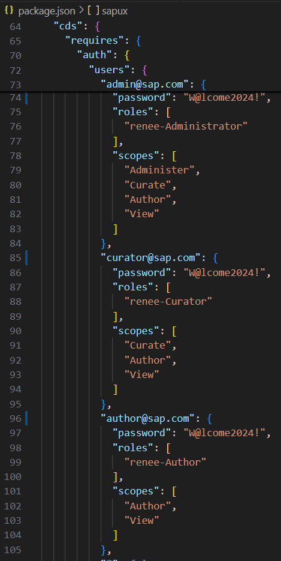
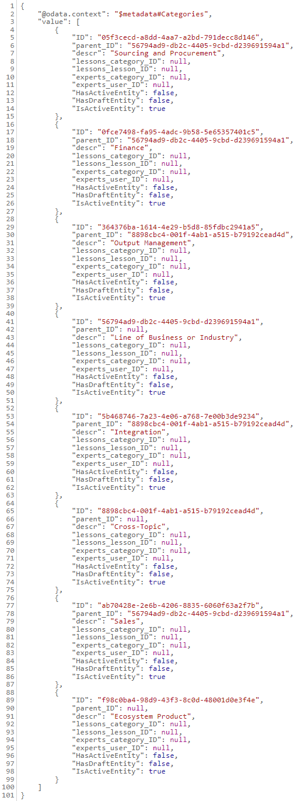
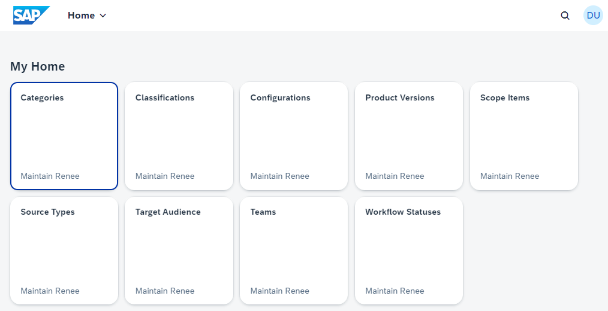
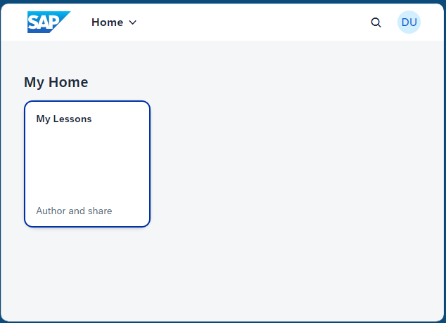
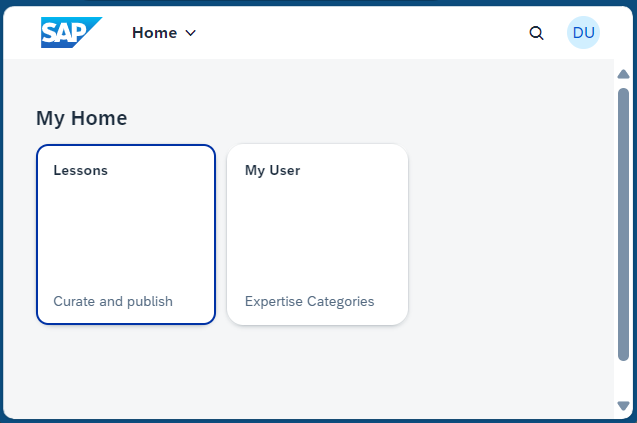

### README for SAP Renee - Lessons Learned Navigator ###

## Description: Renee is a collaboration tool for senior business software implementation consultants sharing their project experiences and content curators. Renee captures these experiences as 'Lessons Learned'. Curators may publish content for rendering on demand as an MS Powerpoint deck. New and aspiring implementation consultants may benefit from downloading Lessons Learned on demand and studying them with their customers. Renee is highly configurable and open source, for many use cases of institutional knowledge capture and curation for quality ##   

Installation: For development clone this repository from here (check for "deploy" branch with latest date <MMDDYYY> to start with after cloning). 
For local further development and dev test: From new terminal at MY-RENEE install dependencies (node_modules) with "npm install". Use "npm outdated" to find dependencies and missing libraries. Start with "cds watch". 
    Open localhost:4004. Decide, which user role to login with , then select any entity of the respective service. E.g. you decided to go for role administrator. From service endpoint /odata/v4/admin select any entity, like "Categories". A sign-in popup window should ask for credentials. Use the one from package.json for administrator, e.g. admin@sap.com. Enter respective password from package.json. You may get a jsonified list of categories like in . But the specific result is not important for our purpose. In the browser window go back one screen and click the link called 'administer.html' (also see below in Web Apps / OData). After some initial spinning you should soon see a page like this .               
For deployment into SAP BTP Cloud Foundry: From folder gen/mta.tar deploy with "cf deploy gen/mta.tar".

Usage: [Examples or instructions on how to use the project. For software, this could be code snippets, screenshots, or demo videos.]

#### Web Apps / OData 

1. Author, app '/author.html', contains single tile to author and edit lessons.   
    OData service at /odata/v4/lesson: Author's app to create new lessons
2. Curate, app '/curate.html', contains two apps, one to curate, the other 
    to self-assign categories of expertise. 
    OData service at /odata/v4/curate: Curators' app to curate apps 
3. Administer app '/administer.html' 
    OData service at /odata/v4/admin:
    * Categories, app categories + 
    * Classifications, app classifications +
    * Configurations for PowerPoint deck generation, app configurations +
    * Scope Items for business and implementation context, app scopeitems +
    * Source Types, for information sources, app sourcetypes + 
    * Target audience, app personas +
    * Teams, to identify curators or authors and give them and ther team credit, app teams +
    * Versions, app versions +
    * Workflow Status, app status +

Contribution: [Guidelines for collaborators who want to contribute to your project. This may include code style preferences, branching strategy, or how to submit a pull request.]

License: The project is open source with MIT license. 
(c) Andreas Muno, SAP 2024
Permission is hereby granted, free of charge, to any person obtaining
a copy of this software and associated documentation files (the
"Software"), to deal in the Software without restriction, including
without limitation the rights to use, copy, modify, merge, publish,
distribute, sublicense, and/or sell copies of the Software, and to
permit persons to whom the Software is furnished to do so, subject to
the following conditions:

The above copyright notice and this permission notice shall be
included in all copies or substantial portions of the Software.

THE SOFTWARE IS PROVIDED "AS IS", WITHOUT WARRANTY OF ANY KIND,
EXPRESS OR IMPLIED, INCLUDING BUT NOT LIMITED TO THE WARRANTIES OF
MERCHANTABILITY, FITNESS FOR A PARTICULAR PURPOSE AND
NONINFRINGEMENT. IN NO EVENT SHALL THE AUTHORS OR COPYRIGHT HOLDERS BE
LIABLE FOR ANY CLAIM, DAMAGES OR OTHER LIABILITY, WHETHER IN AN ACTION
OF CONTRACT, TORT OR OTHERWISE, ARISING FROM, OUT OF OR IN CONNECTION
WITH THE SOFTWARE OR THE USE OR OTHER DEALINGS IN THE SOFTWARE.

Contact Information: Shreeyash Lakhe, SAP, shreeyash.lakhe@sap.com; Andreas Muno, SAP, andreas.muno@sap.com 

Credits and Acknowledgments: [Give credit where it’s due. If you’ve used parts of other projects or if someone gave you a nudge when you were stuck, acknowledge their work.]
